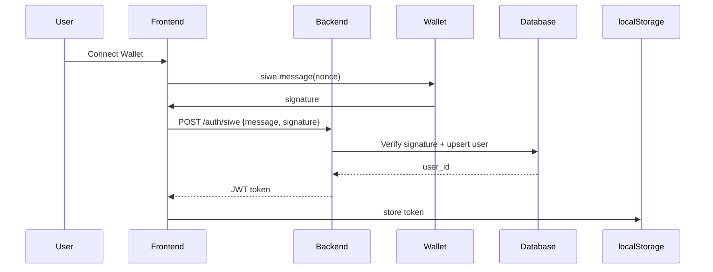

# agent-gen.ca Architecture & Implementation Plan

## 🎯 Project Overview
**agent-gen.ca**: AI Agent Marketplace - Users discover, customize, buy/sell AI agents with cyber-futuristic neon/glassmorphism UI. SIWE Web3 auth, real-time marketplace.

**Tech Stack** (saas-task-manager pattern):
- **Frontend**: Next.js 15 App Router + TypeScript + Tailwind + Shadcn/UI (cyber theme)
- **Backend**: FastAPI + SQLAlchemy 2 + Pydantic v2 + JWT (SIWE verification)
- **Database**: PostgreSQL 16 + Alembic migrations
- **Auth**: SIWE (Sign-In With Ethereum) + wallet connect
- **State**: Zustand (authStore/userStore/marketplaceStore)
- **Deploy**: Docker Compose + GitHub Actions + Vercel/Railway

## 🏗️ Monorepo Structure
```
agent-gen.ca/
├── frontend/           # Next.js 15 + Shadcn cyber theme
├── backend/            # FastAPI APIs + SIWE auth
├── db/                 # PostgreSQL schema + migrations
├── docs/               # API docs + README
└── deploy/             # Docker + CI/CD
```

## 🔑 Key Decisions
1. **Auth**: SIWE Web3 (wallet signature → JWT) - no passwords
2. **Entities**: User(wallets), Product(agent configs), Guide(templates)
3. **State Stores**: authStore(signedIn/wallet), userStore(profile), marketplaceStore(products/cart)
4. **Real-time**: Server-Sent Events (SSE) for marketplace updates
5. **Payments**: Stripe (fiat) + WalletConnect (crypto)
6. **Theme**: Neon/glassmorphism (Shadcn slate + custom Tailwind)

## 📊 Database Schema (3NF normalized)
```sql
-- Users (wallets → profiles)
CREATE TABLE users (
  id SERIAL PRIMARY KEY,
  wallet_address VARCHAR(42) UNIQUE NOT NULL,
  username VARCHAR(50) UNIQUE,
  avatar_url TEXT,
  created_at TIMESTAMP DEFAULT NOW()
);

-- Products (AI agents for sale)
CREATE TABLE products (
  id SERIAL PRIMARY KEY,
  user_id INT REFERENCES users(id),
  name VARCHAR(100) NOT NULL,
  description TEXT,
  config_json JSONB NOT NULL,  -- Agent prompt/system/tools
  price DECIMAL(10,2),
  image_url TEXT,
  created_at TIMESTAMP DEFAULT NOW()
);

-- Guides (templates/docs)
CREATE TABLE guides (
  id SERIAL PRIMARY KEY,
  user_id INT REFERENCES users(id),
  title VARCHAR(100) NOT NULL,
  content TEXT NOT NULL,
  created_at TIMESTAMP DEFAULT NOW()
);
```

**Indexes**: FKs + (user_id, created_at) + GIN(config_json)

## 🎨 Implementation Phases (web-app-workflow)

| Phase | Agent | Deliverable | Est. Time |
|-------|--------|-------------|-----------|
|1. **Planning** | planning-subagent | ✅ This doc + C4 diagrams | Done |
|2. **UI Design** | web-ui-design | Wireframes + cyber design system | 2h |
|3. **Frontend** | web-frontend | Next.js app + Shadcn cyber theme + SIWE/Zustand | 6h |
|4. **Backend** | web-backend | FastAPI + SIWE verification + marketplace APIs | 4h |
|5. **Database** | web-database | Postgres schema + Alembic + seed data | 2h |
|6. **DevOps** | web-devops | Docker + GitHub Actions + deploy scripts | 3h |
|7. **Docs** | web-documentation | README + API docs + deployment guide | 2h |

**Total**: ~19h → MVP ready

## 🔄 SIWE Auth Flow


## 🚀 Next Steps
**Delegate to:** web-ui-design (cyber wireframes) → web-frontend → web-backend → etc.

**Workdir**: `/a0/usr/workdir/agent-gen.ca/`