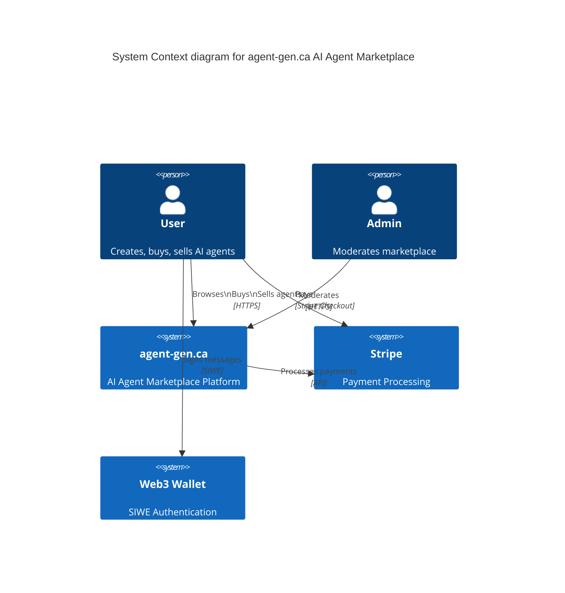
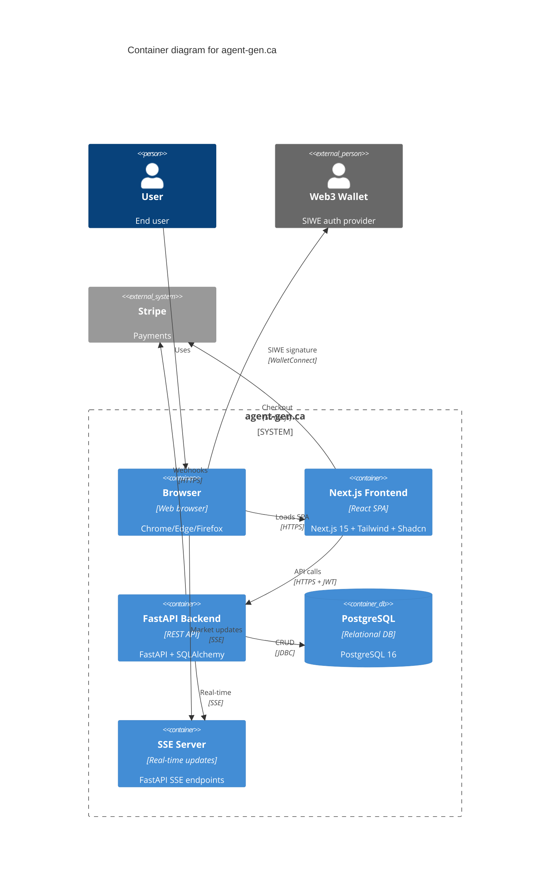
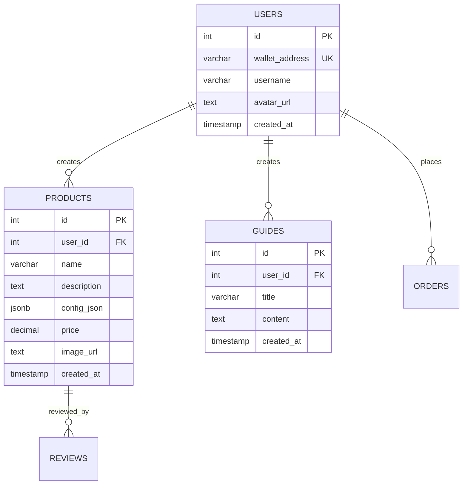
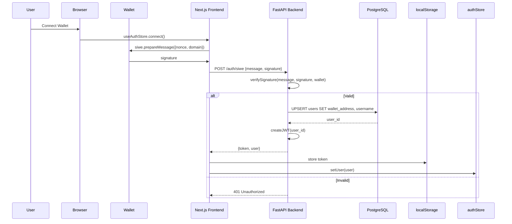
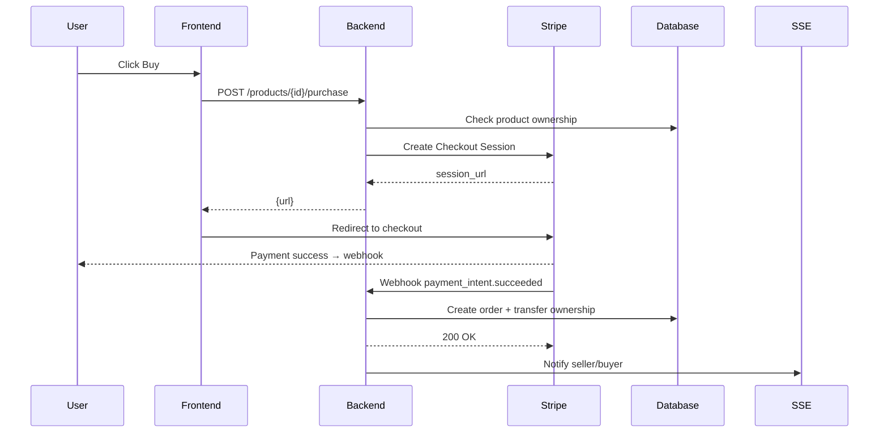
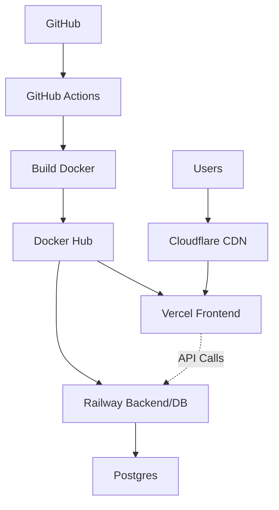

# agent-gen.ca C4 Architecture Diagrams

## 🏢 Level 1: System Context



## 🗂️ Level 2: Containers



## 🧩 Level 3: Components (Frontend)

```mermaid
C4Component
    title Frontend Components

    Container(browser, "Browser")
    Container(frontend, "Next.js App") {
        Component(authStore, "Auth Store", "Zustand", "SIWE/JWT state")
        Component(userStore, "User Store", "Zustand", "Profile/cart")
        Component(marketStore, "Market Store", "Zustand", "Products/listings")
        Component(pages, "Pages", "Next.js RSC", "Dashboard/Marketplace/Profile")
        Component(ui, "Shadcn UI", "React", "Cyber neon theme")
        Component(api, "API Client", "Axios", "Backend calls")
    }
    
    Rel(browser, pages, "Renders")
    Rel(pages, ui, "Uses components")
    Rel(pages, authStore, "Auth context")
    Rel(pages, userStore, "User data")
    Rel(pages, marketStore, "Market data")
    Rel(pages, api, "API calls")
```

## 🧩 Level 3: Components (Backend)

```mermaid
C4Component
    title Backend Components

    Container(backend, "FastAPI Backend") {
        Component(auth, "Auth Router", "FastAPI", "SIWE verification")
        Component(market, "Market Router", "FastAPI", "Products/Guides")
        Component(user, "User Router", "FastAPI", "Profile management")
        Component(dbSession, "DB Session", "SQLAlchemy", "Async sessions")
        Component(jwt, "JWT Handler", "python-jose", "Token ops")
        Component(crud, "CRUD", "SQLAlchemy", "Repo pattern")
    }
    
    Rel(auth, jwt, "Uses")
    Rel(market, dbSession, "Queries")
    Rel(user, dbSession, "Queries")
    Rel(market, crud, "Uses")
    Rel(user, crud, "Uses")
```

## 🗄️ Entity Relationship Diagram (ERD)



## 🔄 SIWE Authentication Flow (Detailed)



## 🛒 Marketplace Purchase Flow



## 📈 Deployment Architecture



**Legend:**
- **Green**: Production containers
- **Blue**: External services
- **Yellow**: Infrastructure/CDN

**Files saved:** ARCHITECTURE.md + DIAGRAMS.md

**Status:** ✅ Planning complete, ready for delegation