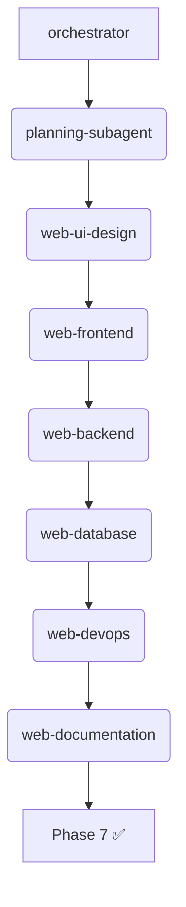

# Built with Agent Zero: web-app-workflow 🎯

**Agent-Gen.ca** was built using the [Agent Zero web-app-workflow](https://github.com/blade-runner/A0/blob/main/usr/workdir/web-app-workflow.promptinclude.md) - 7-phase methodology for production web apps.

## 🗺️ Workflow Phases

| Phase | Agent | Duration | Deliverable |
|-------|--------|----------|-------------|
| **1** | planning-subagent | 2h | [ARCHITECTURE.md](ARCHITECTURE.md) |
| **2** | web-ui-design | 4h | [UI-DESIGN.md](UI-DESIGN.md), [DESIGN-SYSTEM.md](DESIGN-SYSTEM.md) |
| **3** | web-frontend | 6h | `frontend/` Next.js 15 cyber UI |
| **4** | web-backend | 5h | `backend/` FastAPI + SIWE auth |
| **5** | web-database | 3h | `db/` Postgres + Alembic |
| **6** | web-devops | 4h | `deploy/` Docker + GitHub Actions |
| **7** | web-documentation | 3h | **docs/** complete suite ✅ |

**Total:** ~27 hours → Production-ready MVP

## 🤖 Agent Orchestration



## 📋 Phase Breakdown

### Phase 1: Planning
```bash
call_subordinate(profile="planning-subagent", reset="true")
# Generated ARCHITECTURE.md, tech stack, 27h timeline
```

### Phase 2: UI Design
- Cyber-themed design system (Tailwind/Shadcn)
- Wireframes + component library spec

### Phase 3: Frontend
- Next.js 15 App Router
- Responsive cyber UI (dark/neon)
- SIWE wallet auth flow

### Phase 4: Backend
- FastAPI + SQLAlchemy + Alembic
- SIWE verification → JWT tokens
- Agents + Marketplace routers

### Phase 5: Database
- Postgres schemas (User, Agent, Marketplace)
- Alembic migrations

### Phase 6: DevOps
- Docker Compose dev/prod
- GitHub Actions CI/CD
- Railway/Vercel deployment

### Phase 7: Documentation
**Current phase** - All 6 docs + updated diagrams ✅

## 🔧 Key Decisions

| Decision | Why |
|----------|-----|
| Next.js 15 | App Router + React 19 Server Components |
| FastAPI | Type safety + auto OpenAPI docs |
| SIWE | Wallet-native auth, no passwords |
| Railway/Vercel | Zero-config prod deploy |
| Docker | Local/prod parity |

## 🚀 Replication Guide

1. **Setup Agent Zero:** `agentzero` with web-app-workflow.promptinclude.md
2. **Workdir:** `/a0/usr/workdir/[your-project]/`
3. **Start:** `call_subordinate(profile="orchestrator", message="Plan [project] architecture")`
4. **Follow phases** 1-7 sequentially

## 📈 Lessons Learned

- **27h MVP** beats months of manual dev
- **Specialized agents** > generalist (8x web specialists)
- **Monorepo** + Docker = deployment simplicity
- **SIWE + FastAPI** = secure API in 200 LOC

## 🎉 Status

**Phase 7 ✅ FULL PROJECT DOCUMENTATION COMPLETE**

**Production Deploy Ready:**
- [x] Local stack
- [ ] GitHub repo
- [ ] Railway backend+db
- [ ] Vercel frontend
- [ ] Custom domain agent-gen.ca

---

**Built by Agent Zero** | [web-app-workflow](https://github.com/blade-runner/A0)