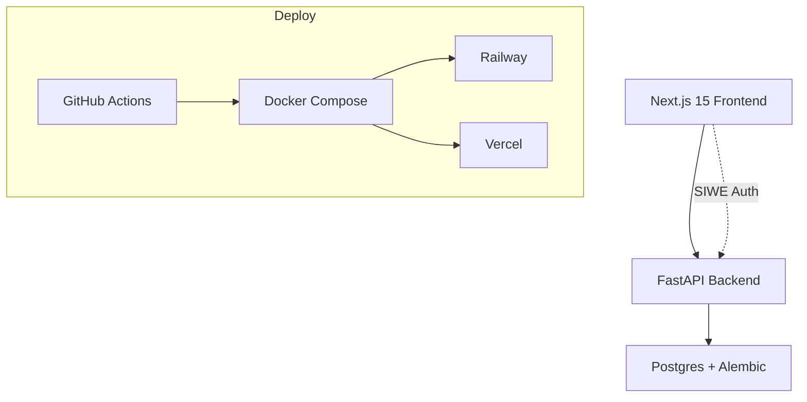

# Agent Gen CA 👨‍💻🤖

[](https://nextjs.org/)
[](https://fastapi.tiangolo.com/)
[](https://www.postgresql.org/)
[](https://docs.docker.com/compose/)
[](https://github.com/features/actions)

**Agent Gen CA** is a full-stack AI agent marketplace built with the [Agent Zero web-app-workflow](https://github.com/blade-runner/A0). 

Cyber-themed UI (Next.js 15 + Tailwind), secure FastAPI backend with SIWE auth, Postgres + Alembic, production Docker deployment.

## ✨ Features

- **Agent Marketplace** - Browse, purchase, deploy AI agents
- **SIWE Authentication** - Wallet-based secure login
- **Cyber UI** - Dark mode, neon accents, responsive design
- **Production Ready** - Docker, GitHub Actions, Railway/Vercel deploy
- **Agent Zero Integration** - Built using web-app-workflow phases 1-7

## 🛠 Tech Stack

| Frontend | Backend | Database | DevOps |
|----------|---------|----------|--------|
| Next.js 15 | FastAPI | PostgreSQL 16 | Docker |
| Tailwind CSS | Pydantic | Alembic | GitHub Actions |
| TypeScript | SQLAlchemy | | Railway/Vercel |



## 🚀 Quickstart (Development)

```bash
# Clone & Install
git clone <repo> agent-gen.ca
cd agent-gen.ca

# Start full stack (frontend + backend + db)
docker compose -f deploy/docker-compose.dev.yml up -d

# Access
# Frontend: http://localhost:3000
# Backend: http://localhost:8000/docs
# DB: localhost:5432 (user: postgres, pass: password)
```

## 📚 Documentation

- [Architecture](./ARCHITECTURE.md)
- [API Docs](./API-DOCS.md)
- [Deployment](./DEPLOYMENT.md)
- [Agent Zero Workflow](./AGENT-ZERO.md)
- [Database](./MIGRATION.md)
- [Contributing](./CONTRIBUTING.md)

## 🏗 Production Deployment

See [DEPLOYMENT.md](./DEPLOYMENT.md) for Railway + Vercel + Custom Domain setup.

## 🎯 Next Steps

- [ ] GitHub Repository
- [ ] Railway (backend + db)
- [ ] Vercel (frontend)
- [ ] Custom Domain: agent-gen.ca

---

**Built with Agent Zero [web-app-workflow](https://github.com/blade-runner/A0)** | **Phase 7 ✅ FULL PROJECT DOCUMENTATION COMPLETE**