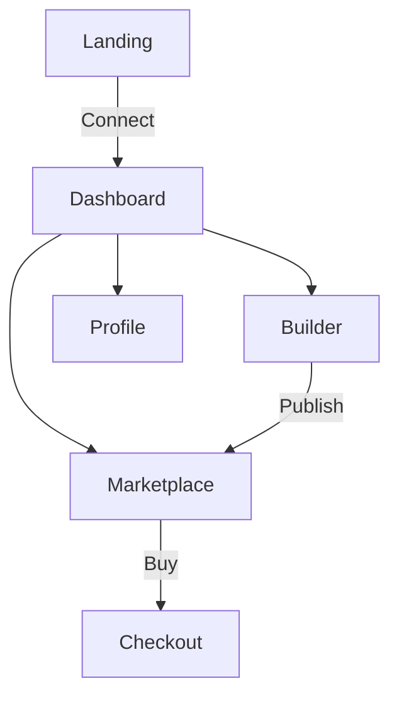

# agent-gen.ca UI Design Specification

## 🎨 Design Theme: Cyber-Futuristic Neon/Glassmorphism

**Color Palette:**
- Primary: #00f5ff (Cyan Neon)
- Secondary: #ff00ff (Magenta Neon)
- Accent: #39ff14 (Lime Neon)
- Background: #0a0a0a (Deep Black)
- Surface: #1a1a1a (Dark Gray)
- Glass: rgba(255,255,255,0.1) backdrop-blur
- Text: #ffffff (White), #b0b0b0 (Secondary)

**Typography:** JetBrains Mono (monospace) + Inter
**Effects:** Glow, scanlines, terminal flicker

## 📱 Page Wireframes (Mermaid)

### 1. Landing Page
graph LR
    A[Hero: "AI Agent Marketplace<br/>Discover. Customize. Deploy."] --> B[Neon CTA: Connect Wallet]
    B --> C[Featured Agents Grid]
    C --> D[Market Stats: 500+ Agents, $50K Volume]
    D --> E[Categories: Coding, Marketing, Security]

### 2. Dashboard
graph TD
    A[Sidebar: Dashboard/Build/Marketplace/Profile] --> B[Header: Wallet Balance + Notifications]
    B --> C[Agent Cards: My Agents + Recent Activity]
    C --> D[Quick Actions: New Agent / Deploy / Edit]

### 3. Agent Builder
graph LR
    A[Prompt Editor<br/>System/User Messages] --> B[Tools Panel]
    B --> C[Preview Terminal]
    C --> D[Deploy Button: Marketplace / Private]

### 4. Marketplace
graph TD
    A[Search + Filters<br/>Category/Price/Rating] --> B[Agent Cards Grid]
    B --> C[Agent Detail Modal<br/>Config JSON + Demo + Buy]

### 5. Docs
graph LR
    A[Sidebar TOC] --> B[Markdown Content]
    B --> C[Code Blocks + Mermaid Diagrams]

## 🔄 Page Flows


## 🧩 Component Hierarchy
```
App
├── Layout (Neon Header + Glass Sidebar)
├── Pages
│   ├── Landing
│   │   ├── Hero
│   │   ├── Stats
│   │   └── Categories
│   ├── Dashboard
│   │   ├── AgentGrid
│   │   └── QuickActions
│   ├── Builder
│   │   ├── PromptEditor
│   │   ├── ToolsPanel
│   │   └── TerminalPreview
│   ├── Marketplace
│   │   ├── SearchFilters
│   │   └── AgentCardGrid
│   └── Docs
│       ├── DocSidebar
│       └── MarkdownViewer
├── UI Components (Shadcn)
│   ├── Button (Neon Glow)
│   ├── Card (Glassmorphism)
│   ├── Input (Terminal Style)
│   ├── Modal (Cyber Overlay)
│   └── Badge (Neon Labels)
└── Stores (Zustand)
    ├── authStore
    ├── marketStore
    └── builderStore
```

**Next.js/Shadcn Ready** ✅
